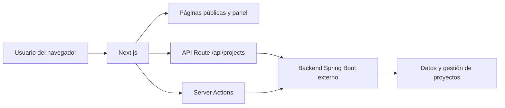

# Portafolio personal

Portafolio web de Bryan Zavala, desarrollado como una aplicación real para mostrar mis proyectos y practicar cómo se conectan una interfaz moderna, una API propia, autenticación y un backend externo.

El proyecto tiene dos objetivos:

1. Presentar mi perfil, tecnologías, proyectos y formas de contacto.
2. Servirme como laboratorio de aprendizaje para entender mejor Next.js, React, TypeScript, accesibilidad, rendimiento y comunicación con un backend.

> Soy desarrollador junior. Este README explica las decisiones con palabras sencillas y señala también qué partes están en evolución. Prefiero mostrar el estado real del proyecto antes que presentar como terminado algo que todavía estoy aprendiendo.

## Demo

- Web pública: [portafolio.bryanzavala.com](https://portafolio.bryanzavala.com/es)
- Idiomas disponibles: español (`/es`) e inglés (`/en`)

## Qué hace la aplicación

### Parte pública

- Hero inicial con presentación, llamada a la sección de proyectos y enlaces sociales.
- Carrusel de tecnologías.
- Proyectos cargados desde el backend y agrupados en Frontend, Backend y Full Stack.
- Botón para mostrar primero la categoría Full Stack.
- Página "Sobre mí" con experiencia, habilidades y stack tecnológico.
- Página de contacto con email, ubicación y redes sociales.
- Cambio de idioma entre español e inglés.
- Cambio entre tema claro y oscuro.
- Animaciones con Framer Motion, respetando la preferencia del usuario por reducir movimiento.
- Cursor visual con estela en dispositivos que tienen un ratón preciso. En móviles se desactiva para que tocar la pantalla no deje puntos visuales.
- Metadatos Open Graph y Twitter para que la web tenga una imagen correcta al compartirla en LinkedIn u otras plataformas.

### Panel privado

- Login de administración.
- Creación de proyectos.
- Edición de proyectos.
- Borrado de proyectos.
- Selección de categoría: `FRONTEND`, `BACKEND` o `FULLSTACK`.
- Introducción del stack tecnológico separado por comas.
- Envío opcional de enlaces a GitHub y a la demo.
- Subida de imágenes con límite de 5 MB y comprobación del tipo de archivo.
- Tabla para consultar los proyectos existentes.

El panel se encuentra en `/{idioma}/dashboard`. Si no existe una cookie de sesión, el usuario vuelve al login.

## Arquitectura general

El backend de Spring Boot no está incluido en este repositorio. Este proyecto contiene el frontend Next.js y una pequeña capa de servidor que se comunica con ese backend.



### Flujo público de proyectos

1. El navegador solicita `/api/projects`.
2. La API Route llama a `getProjects`.
3. `getProjects` hace una petición `GET` al endpoint `/projects` del backend Spring Boot.
4. Next.js devuelve los proyectos al navegador.
5. La interfaz agrupa cada proyecto según su categoría.
6. Si un proyecto antiguo no tiene categoría, se intenta deducir por sus tecnologías.

La consulta del servidor utiliza una revalidación de 300 segundos. La API también comunica una caché de 5 minutos y permite servir contenido antiguo durante otros 10 minutos mientras se actualiza.

### Flujo de administración

1. El usuario envía email y contraseña desde el login.
2. Una Server Action de Next.js llama a `/auth/login` en Spring Boot.
3. El backend devuelve un token JWT.
4. Next.js guarda el token en una cookie `httpOnly`.
5. Las acciones de crear, editar y borrar leen esa cookie y envían el token como `Authorization: Bearer ...`.
6. Después de una mutación, Next.js invalida las rutas y etiquetas de caché relacionadas con proyectos.

La validación definitiva de permisos debe hacerla el backend Spring Boot. El frontend comprueba que existe la cookie para proteger sus rutas y después envía el token al backend.

## Stack tecnológico

### Aplicación

- **Next.js 16** con App Router: estructura de rutas, renderizado de servidor, API Routes y Server Actions.
- **React 19**: componentes y estado de la interfaz.
- **TypeScript**: tipos para proyectos, diccionarios, formularios y props.
- **Tailwind CSS 4**: estilos mediante clases utilitarias.
- **Framer Motion**: entradas, hover, pulsación, transiciones y animaciones de las tarjetas.
- **Lucide React, Tabler Icons y Simple Icons**: iconos y tecnologías visuales.
- **Lottie React**: animaciones de las páginas de perfil y contacto.
- **Zustand**: estado del tema claro/oscuro.

### Integración de datos

- **Spring Boot externo**: autenticación y operaciones CRUD de proyectos.
- **JWT**: token recibido del backend para identificar la sesión de administración.
- **FormData**: envío de formularios con imágenes.
- **Fetch de Next.js**: comunicación servidor-servidor con el backend.

Este repositorio no contiene Supabase, Drizzle ni una base de datos propia. Los datos pertenecen al backend Spring Boot que se configura mediante una variable de entorno.

### Calidad y rendimiento

- **ESLint**: reglas de calidad y errores comunes.
- **Prettier**: formato consistente.
- **TypeScript**: comprobación estática.
- **Jest + Testing Library**: pruebas de componentes.
- **Lighthouse CI**: comprobaciones de rendimiento, accesibilidad, buenas prácticas y SEO.
- **Gitleaks en GitHub Actions**: búsqueda de secretos publicados accidentalmente.
- **LazyMotion**: carga más ligera de las funcionalidades de Framer Motion.
- **Next/Image**: optimización de imágenes remotas y locales.

## Estructura principal

```text
.
├── public/
│   ├── avatar-og.png          # Imagen para LinkedIn/Open Graph
│   ├── avatar.webm            # Avatar animado del hero
│   └── documents/             # Documentos públicos, como el CV
├── src/
│   ├── app/
│   │   ├── [lang]/
│   │   │   ├── (public)/      # Inicio, Sobre mí y Contacto
│   │   │   └── (admin)/       # Login y dashboard
│   │   ├── api/projects/      # API Route pública para proyectos
│   │   └── dictionaries/      # Traducciones es/en
│   ├── components/
│   │   ├── home/              # Hero, tarjetas y sección de proyectos
│   │   ├── layout/            # Navbar y Footer
│   │   ├── organisms/         # Bloques grandes de About y Contacto
│   │   ├── projects/          # Formulario y editor del panel
│   │   └── ui/                # Componentes reutilizables
│   ├── hooks/                 # Lógica reutilizable, como el cursor
│   ├── lib/
│   │   ├── admin/             # Sesión y validaciones
│   │   ├── security/          # Utilidades de seguridad
│   │   └── queries.ts         # Peticiones al backend
│   ├── store/                 # Estado global del tema
│   └── types/                 # Contratos TypeScript
├── .github/workflows/ci.yml   # Pipeline de GitHub Actions
├── jest.config.ts             # Configuración de pruebas
├── lighthouserc.js            # Configuración de Lighthouse CI
├── next.config.ts             # Configuración de Next.js
└── package.json               # Scripts y dependencias
```

## Rutas principales

| Ruta            | Uso                                           |
| --------------- | --------------------------------------------- |
| `/`             | Redirige al idioma detectado por el navegador |
| `/es`           | Inicio en español                             |
| `/en`           | Inicio en inglés                              |
| `/es/about`     | Página Sobre mí en español                    |
| `/en/about`     | Página Sobre mí en inglés                     |
| `/es/contacto`  | Página de contacto en español                 |
| `/en/contacto`  | Página de contacto en inglés                  |
| `/es/login`     | Login de administración                       |
| `/es/dashboard` | Gestión privada de proyectos                  |
| `/api/projects` | Lectura de proyectos para la web pública      |

El archivo `src/proxy.ts` detecta el idioma preferido del navegador y redirige las rutas que no tienen idioma a `/es` o `/en`.

## Contrato esperado del backend

La variable `NEXT_PUBLIC_API_URL` debe apuntar a la raíz de la API del backend. En desarrollo, el valor habitual es `http://localhost:8080/api`.

| Método   | Endpoint        | Uso                                                           |
| -------- | --------------- | ------------------------------------------------------------- |
| `POST`   | `/auth/login`   | Recibe email y contraseña y devuelve un token                 |
| `GET`    | `/projects`     | Devuelve la lista de proyectos                                |
| `POST`   | `/projects`     | Crea un proyecto y recibe una imagen como multipart/form-data |
| `PUT`    | `/projects/:id` | Actualiza un proyecto                                         |
| `DELETE` | `/projects/:id` | Borra un proyecto                                             |

El formulario del frontend usa nombres visuales como `imageFile`, `techStack`, `githubUrl` y `liveUrl`. Las Server Actions adaptan algunos nombres al contrato que espera Java antes de enviar la petición.

## Instalación local

### Requisitos

- Node.js `24.8.0`, indicado en `.nvmrc`.
- npm.
- Una instancia del backend Spring Boot ejecutándose y accesible.

### Pasos

1. Clona el repositorio:

   ```bash
   git clone https://github.com/BryanDZV/Portafolio.git
   cd Portafolio
   ```

2. Instala las dependencias:

   ```bash
   npm install
   ```

3. Crea `.env.local` en la raíz. Este archivo está ignorado por Git y no debe publicarse:

   ```env
   NEXT_PUBLIC_API_URL="http://localhost:8080/api"
   NEXT_PUBLIC_SITE_URL="http://localhost:3000"
   ```

   `NEXT_PUBLIC_API_URL` es necesaria para hablar con Spring Boot.

   `NEXT_PUBLIC_SITE_URL` se utiliza para construir URLs absolutas de Open Graph. En producción debe contener el dominio público:

   ```env
   NEXT_PUBLIC_SITE_URL="https://portafolio.bryanzavala.com"
   ```

4. Arranca Next.js:

   ```bash
   npm run dev
   ```

5. Abre [http://localhost:3000/es](http://localhost:3000/es).

Si el backend no está encendido, la interfaz pública muestra un estado vacío en la sección de proyectos y registra el error en el servidor. El login y las operaciones del panel sí necesitan que Spring Boot esté disponible.

## Scripts disponibles

```bash
npm run dev          # Servidor de desarrollo
npm run build        # Compilación de producción
npm run start        # Arranca la compilación de producción
npm run lint         # Ejecuta ESLint
npm test             # Ejecuta las pruebas de Jest
npm run test:watch   # Ejecuta Jest observando cambios
npm run lhci:autorun # Ejecuta Lighthouse CI
npm run ci:local     # Lint + formato + TypeScript + build
```

El comando más útil antes de subir cambios es:

```bash
npm run ci:local
```

El pipeline de GitHub añade además pruebas, Gitleaks y Lighthouse CI. Se ejecuta en pushes a `main` y en pull requests hacia `main`.

## Pruebas actuales

Las pruebas existentes están centradas en componentes y comportamiento visible:

- `ProjectCard`: muestra título, imagen, tecnologías, enlaces y fallback cuando faltan datos.
- `Button`: renderiza un botón accesible.
- `LanguageSwitcher`: cambia de `/es/contacto` a `/en/contacto` conservando la página actual.

La dependencia de Playwright está instalada para poder añadir pruebas E2E, pero todavía no existe un flujo E2E configurado en los scripts actuales. El siguiente paso razonable sería probar el login y el CRUD con un backend de pruebas.

## Decisiones que estoy practicando

### Server Components y Client Components

Las páginas y consultas que no necesitan interacción pueden ejecutarse en el servidor. Los componentes que usan `useState`, eventos, animaciones o APIs del navegador llevan `"use client"`.

Esto ayuda a enviar menos JavaScript al navegador y separa la lógica de servidor de la interacción visual.

### Server Actions

El login y las operaciones del dashboard usan funciones de servidor. El formulario no llama directamente al backend desde el navegador: Next.js recibe los datos, lee la cookie de sesión y hace la petición al backend desde el servidor.

### Tipado con TypeScript

Los tipos de `Project`, los diccionarios y los formularios describen los datos que espera cada parte. El objetivo es detectar errores antes de ejecutar la aplicación, por ejemplo enviar un campo que no existe o utilizar una categoría desconocida.

### Caché y revalidación

Los proyectos no se solicitan al backend en cada render. Next.js conserva el resultado durante un tiempo y las Server Actions invalidan esa caché después de crear, editar o borrar un proyecto.

### Accesibilidad y movimiento

Los botones y enlaces usan estados de foco visibles para poder navegar con teclado. Las animaciones consultan `prefers-reduced-motion` y el cursor personalizado solo se activa cuando hay un puntero preciso.

## Áreas de mejora

- Validar de forma uniforme todos los campos del proyecto dentro de las Server Actions antes de llamar al backend.
- Añadir pruebas para login, creación, edición, borrado y errores del backend.
- Añadir pruebas E2E con Playwright.
- Mejorar la validación criptográfica de la sesión en Next.js, dejando la autorización final en Spring Boot.
- Revisar el rate limiting para asegurar que se aplica en las acciones que lo necesitan y que funciona correctamente en un entorno distribuido.
- Añadir estados de error más específicos para cuando el backend no está disponible.
- Seguir revisando Lighthouse y el tamaño de JavaScript enviado al navegador.
- Mejorar la imagen social para que mantenga una composición panorámica de aproximadamente 1200 x 630 píxeles.

## Objetivo profesional

Este proyecto representa mi forma de aprender: construir una funcionalidad, entender qué problema resuelve, comprobarla y dejar documentado el razonamiento. No pretende ser un framework ni una solución universal; es una aplicación personal en evolución donde practico frontend, integración con APIs, autenticación, validación, rendimiento y calidad de código.

## Licencia

Proyecto personal de Bryan Zavala. El código está publicado con fines de portfolio y aprendizaje.

# Mi Portafolio Personal

Este es el repositorio de mi portafolio web. Lo creé con un doble propósito: tener un lugar bonito donde mostrar los proyectos que voy haciendo y, sobre todo, usarlo como excusa para aprender a fondo tecnologías modernas como **Next.js, TypeScript y bases de datos con Supabase**.

## ¿De qué trata el proyecto?

Básicamente es una web dividida en dos partes:

1. **La web pública:** Donde los reclutadores y visitantes pueden ver mis proyectos, tecnologías que manejo y contactarme.En proceso para varios idiomas.
2. **Un panel de administración privado:** Una zona oculta con login donde puedo gestionar (crear, editar, borrar) mis proyectos directamente conectados a una base de datos, sin tener que tocar el código fuente cada vez que quiero subir algo nuevo.

## Tecnologías que utilicé

Elegí este stack porque son las herramientas que más se usan hoy en día y quería retarme a entender cómo funcionan juntas en un entorno más cercano a lo real:

- **Frontend:** Next.js (con App Router), React, Tailwind CSS y Framer Motion (para darle un toque de animaciones fluidas).
- **Lenguaje:** TypeScript .
- **Backend y Base de Datos:** Supabase (para la autenticación y guardar datos en Postgres) + Drizzle ORM (para interactuar con la base de datos de forma fácil y tipada).
- **Estado global:** Zustand (súper ligero y mucho más fácil de entender que Redux).
- **Testing & Calidad:** Estoy empezando a configurar pruebas con Jest y Playwright, además de usar ESLint para mantener el código limpio.

## Cómo ejecutarlo en tu PC

Si quieres clonar el repo y trastear con el código (o si eres reclutador y quieres ver cómo lo he montado), aquí tienes los pasos:

1. Necesitas Node.js instalado (versión 20 o superior).
2. Clona este repositorio y abre la carpeta en tu terminal.
3. Instala las dependencias:
   ```bash
   npm install
   ```
4. Configura las variables de entorno. Crea un archivo `.env.local` en la raíz del proyecto y añade tus credenciales (necesitarás un proyecto gratuito en Supabase):
   ```env
   DATABASE_URL="tu_url_de_postgres"
   NEXT_PUBLIC_SUPABASE_URL="tu_url_de_supabase"
   NEXT_PUBLIC_SUPABASE_ANON_KEY="tu_anon_key"
   ```
5. Arranca el servidor de desarrollo:
   ```bash
   npm run dev
   ```
6. Abre `http://localhost:3000` en tu navegador y listo.

## Próximos pasos (Lo que quiero mejorar)

Como perfil Junior, Este proyecto es mi "patio de juegos" y poco a poco lo voy puliendo. Mi lista de tareas incluye:

- [ ] Terminar algunas validaciones visuales en el formulario de edición de proyectos.
- [ ] Aumentar poco a poco la cobertura de testing (unitario y E2E).
- [ ] Refactorizar algunos componentes para que el código quede aún más limpio.
- [ ] Seguir mejorando el rendimiento basándome en lo que me dice Lighthouse.

---

¡Gracias por pasarte a mirar mi código! Cualquier feedback o sugerencia de mejora es súper bien recibida.
